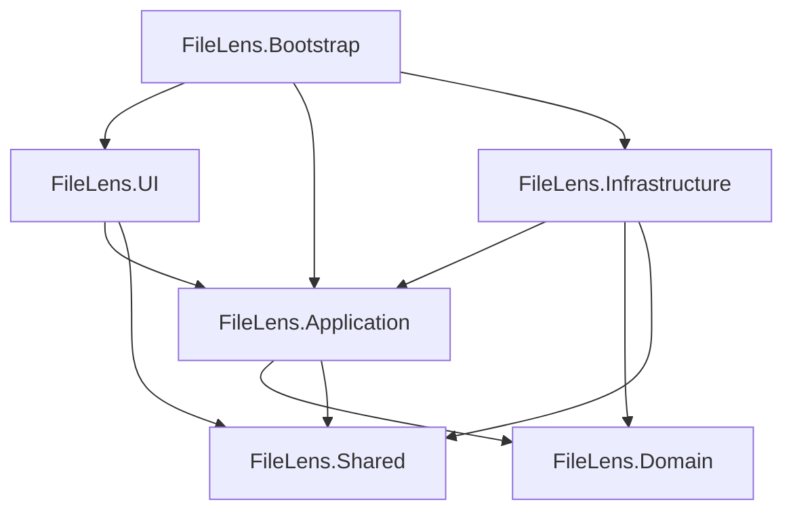

# Architecture

FileLens retains Strict Clean Architecture under ADR-0002 in `DECISIONS.md`. Arrows below mean project references, not execution order.

## Current Project Dependencies

| Project | Current References | Responsibility |
|---------|--------------------|----------------|
| FileLens.Bootstrap | UI, Application, Infrastructure | Executable composition root, WPF startup, Host lifecycle |
| FileLens.UI | Application, Shared | Views, ViewModels, user interaction |
| FileLens.Application | Domain, Shared | Use cases, service contracts, scan DTOs |
| FileLens.Domain | None | Product rules and domain models when required |
| FileLens.Infrastructure | Application, Domain, Shared | Filesystem, persistence, AI provider, and logging implementations |
| FileLens.Shared | None | Limited common constants, models, and extensions |

These references match the current `.csproj` files and Engineering Spec. Infrastructure implements contracts owned by Application or Domain; Domain never references Infrastructure. UI never references Infrastructure directly.

The current scanner contract and DTOs belong to Application, with `WindowsFolderScanner` in Infrastructure. Domain and Shared currently have no feature types; placeholder projects do not require duplicate scan entities.

## Runtime Composition Root

`FileLens.Bootstrap` is the `net10.0-windows` WPF `WinExe`. Its STA entry point owns Host construction and the WPF dispatcher lifecycle. UI is a WPF library, with default ApplicationDefinition disabled: App.xaml is compiled once by the SDK's default Page items and generates no executable entry point. Bootstrap has no direct Domain or Shared reference.

`BootstrapHostBuilder.Create()` composes Application, Infrastructure, and UI registrations. Application registers transient `IScanFolderUseCase -> ScanFolderUseCase`. Infrastructure registers transient `IFolderScanner -> WindowsFolderScanner`. `UiHostBuilder.AddUiServices()` registers singleton App and transient MainWindow / MainWindowViewModel; it no longer creates a Host or registers other layers.

Bootstrap resolves App on STA and calls InitializeComponent once. Startup awaits Host.StartAsync before resolving and showing MainWindow. The window receives its ViewModel through constructor injection and sets DataContext. StartupUri is absent. UI receives no IServiceProvider and retains no Infrastructure reference; container resolution is confined to composition and registration factories.

Normal window close is deferred while Bootstrap awaits Host.StopAsync with a ten-second cancellation timeout, then disposes the Host and shuts down WPF. Duplicate close requests cannot bypass cleanup. Host stopping signals are marshaled to the WPF dispatcher. Cleanup also covers startup failure; errors use a minimal dialog and Trace before logging is available. Forced process termination is not a graceful-shutdown guarantee.

The default Generic Host lifetime is retained. Explicit StartAsync / StopAsync and the ApplicationStopping bridge passed both Host tests and executable desktop smoke checks, so no custom IHostLifetime or feature background service is needed.

The existing Infrastructure Serilog registration owns file logging through DI. It preserves the static logger, and Host disposal flushes and releases its sink. Relative logging directories use `%LOCALAPPDATA%/FileLens`; the existing `logs` default therefore becomes `%LOCALAPPDATA%/FileLens/logs`. Absolute overrides via `FileLens:Logging:LogDirectory` are preserved. Host content root is AppContext.BaseDirectory, independent of the working directory. No new bootstrap logger, settings service, or persistence behavior is introduced.

`FileLens.BootstrapTests` references Bootstrap and checks production Host composition without constructing WPF Application. A single STA construction check covers compiled MainWindow XAML and injected DataContext. Existing scanner IntegrationTests remain independent of WPF and runtime composition. Actual desktop lifecycle is checked separately; see `../tests/FileLens.BootstrapTests/README.md`.

## Application Scan Execution Path

`IScanFolderUseCase.ExecuteAsync(string folderPath, CancellationToken cancellationToken = default)`
is implemented by sealed `ScanFolderUseCase`, with `IFolderScanner` as its sole injected dependency.
It checks cancellation first, then null / empty / whitespace input, and calls the scanner once.
Paths and tokens are forwarded unchanged. Complete / Partial ScanResult instances and scanner
exceptions are preserved without mapping, wrapping, retry, timeout, or synthesized results.
Application performs no filesystem validation; normalization, existence, access, drive type,
reparse, and protected-directory policies remain in Infrastructure.

`FileLens.UnitTests` targets net10.0 and directly references only Application. An instance fake
validates Application behavior without filesystem access, WPF, Bootstrap, or a mocking framework.
The Application registration is already included by the existing Bootstrap builder; no Bootstrap
or ViewModel changes were needed. The current UI does not invoke the Use Case.

Production scanning through the Use Case remains a full-sprint integration verification item.
Active scan shutdown coordination remains unimplemented and requires separate approval.
Stopping Host alone does not cancel scanner tasks. See `../SPRINT.md` for remaining tasks.

## Deferred Infrastructure

SQLite remains the persistence choice, with actual history / persistence planned for provisional Sprint 7. AI implementations belong to Infrastructure and will use the planned Application `IAIProvider` contract; the first recommendation feature targets provisional Sprint 6. Safe file operations, operation history, and undo / recovery target Sprint 8 and require the documented confirmation pipeline.

Future sprint numbers remain adjustable through separate planning. Accepted ADRs and existing project boundaries are unchanged.
